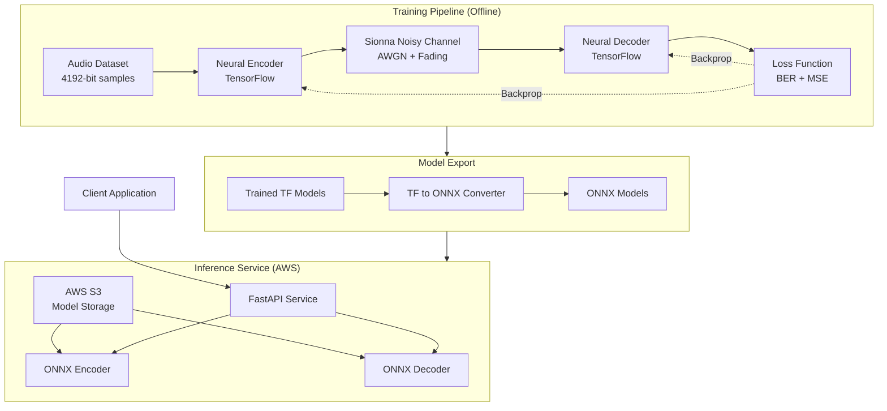
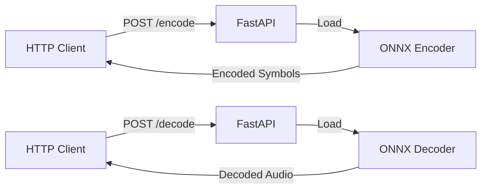
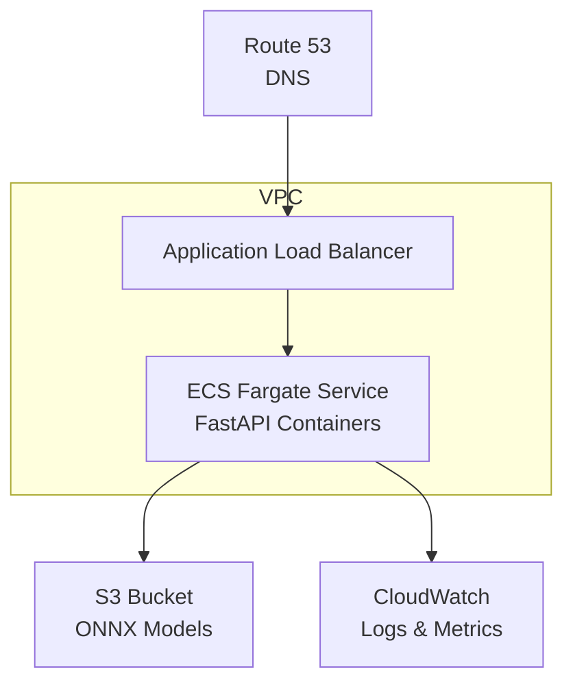

# Design Document: Terrain-Adaptive Neural Codec

## Overview

This document describes the design of a neural encoder-decoder system for reliable 4192-bit audio transmission over noisy channels in harsh terrain environments. The system consists of two main components:

1. **Training Pipeline**: Uses NVIDIA Sionna with TensorFlow to train encoder-decoder models on simulated noisy channels
2. **Inference Service**: FastAPI-based REST API deployed on AWS that uses ONNX models for encoding and decoding

The neural codec learns to optimize signal representations specifically for noisy channel conditions, achieving better bit error rates than conventional coding schemes at low SNR levels typical of harsh terrain.

### Key Design Decisions

- **TensorFlow + Sionna**: Leverages Sionna's differentiable channel models for end-to-end gradient-based training
- **ONNX Export**: Enables platform-independent deployment and optimized inference
- **FastAPI**: Provides lightweight, high-performance API with automatic OpenAPI documentation
- **AWS Deployment**: Ensures scalability, reliability, and global accessibility
- **4192-bit Fixed Size**: Simplifies architecture and allows for optimized neural network design

## Architecture

### High-Level System Architecture



### Training Architecture

The training pipeline implements an autoencoder architecture with a noisy channel in the middle:

```
Input (4192 bits) → Encoder → Channel Symbols → Noisy Channel → Received Symbols → Decoder → Output (4192 bits)
```

The encoder and decoder are trained jointly to minimize reconstruction error, learning to be robust against channel noise.

### Inference Architecture



## Components and Interfaces

### 1. Neural Encoder

**Purpose**: Transform 4192-bit audio into channel-optimized symbols

**Architecture**:
- Input Layer: 4192 binary values (reshaped to suitable dimensions)
- Hidden Layers: Fully connected or 1D convolutional layers
- Normalization: Power constraint to simulate transmit power limits
- Output Layer: Complex-valued symbols (I/Q components) for transmission

**Interface**:
```python
class NeuralEncoder(tf.keras.Model):
    def __init__(self, input_bits: int = 4192, num_symbols: int, constellation_size: int):
        """
        Args:
            input_bits: Number of input bits (4192)
            num_symbols: Number of channel symbols to output
            constellation_size: Points per symbol (e.g., 2 for BPSK, 4 for QPSK)
        """
        
    def call(self, bits: tf.Tensor) -> tf.Tensor:
        """
        Args:
            bits: Tensor of shape (batch_size, 4192) with binary values
        Returns:
            symbols: Complex tensor of shape (batch_size, num_symbols, 2) 
                    representing I/Q components
        """
```

**Design Considerations**:
- Power normalization ensures average transmit power constraint
- Output dimensionality (num_symbols) determines bandwidth efficiency
- Can use dense layers for simplicity or Conv1D for local pattern learning

### 2. Neural Decoder

**Purpose**: Reconstruct 4192-bit audio from noisy received symbols

**Architecture**:
- Input Layer: Noisy complex symbols (I/Q components)
- Hidden Layers: Fully connected or 1D convolutional layers
- Output Layer: 4192 logits with sigmoid activation for bit probabilities

**Interface**:
```python
class NeuralDecoder(tf.keras.Model):
    def __init__(self, num_symbols: int, output_bits: int = 4192):
        """
        Args:
            num_symbols: Number of received channel symbols
            output_bits: Number of output bits (4192)
        """
        
    def call(self, received_symbols: tf.Tensor) -> tf.Tensor:
        """
        Args:
            received_symbols: Tensor of shape (batch_size, num_symbols, 2)
        Returns:
            bit_logits: Tensor of shape (batch_size, 4192) with bit probabilities
        """
```

**Design Considerations**:
- Decoder must handle varying noise levels (different SNRs)
- Sigmoid output provides soft decisions for each bit
- Can threshold at 0.5 for hard decisions

### 3. Sionna Channel Model

**Purpose**: Simulate realistic noisy channel conditions for training

**Channel Types**:
- AWGN (Additive White Gaussian Noise): Base noise model
- Fading: Rayleigh or Rician fading for multipath effects
- Combined: AWGN + Fading for realistic harsh terrain

**Interface**:
```python
from sionna.channel import AWGN, RayleighBlockFading

class ChannelModel:
    def __init__(self, snr_db: float, add_fading: bool = True):
        """
        Args:
            snr_db: Signal-to-noise ratio in dB
            add_fading: Whether to add fading effects
        """
        self.awgn = AWGN()
        self.fading = RayleighBlockFading(...) if add_fading else None
        
    def __call__(self, symbols: tf.Tensor, snr_db: tf.Tensor) -> tf.Tensor:
        """
        Args:
            symbols: Transmitted symbols (batch_size, num_symbols, 2)
            snr_db: SNR in dB for this batch
        Returns:
            noisy_symbols: Received symbols after channel effects
        """
```

**Design Considerations**:
- SNR is a training parameter - vary it to learn robust representations
- Fading adds realism for harsh terrain scenarios
- Channel is differentiable, allowing end-to-end training

### 4. Training Loop

**Purpose**: Train encoder-decoder end-to-end with Sionna channel

**Training Process**:
1. Sample batch of 4192-bit audio data
2. Encode with neural encoder
3. Pass through Sionna noisy channel at random SNR
4. Decode with neural decoder
5. Compute loss (BER + reconstruction loss)
6. Backpropagate through entire pipeline
7. Update encoder and decoder weights

**Interface**:
```python
class CodecTrainer:
    def __init__(self, encoder: NeuralEncoder, decoder: NeuralDecoder, 
                 channel: ChannelModel, snr_range: Tuple[float, float]):
        """
        Args:
            encoder: Neural encoder model
            decoder: Neural decoder model
            channel: Sionna channel model
            snr_range: (min_snr_db, max_snr_db) for training
        """
        
    def train_step(self, audio_bits: tf.Tensor) -> Dict[str, float]:
        """
        Single training step
        Args:
            audio_bits: Batch of 4192-bit audio samples
        Returns:
            metrics: Dictionary with loss, BER, etc.
        """
        
    def train(self, dataset: tf.data.Dataset, epochs: int) -> None:
        """
        Full training loop
        """
```

**Loss Function**:
```python
def codec_loss(original_bits, decoded_logits):
    # Binary cross-entropy for bit-level reconstruction
    bce_loss = tf.keras.losses.binary_crossentropy(original_bits, decoded_logits)
    
    # Bit error rate for monitoring
    decoded_bits = tf.cast(decoded_logits > 0.5, tf.float32)
    ber = tf.reduce_mean(tf.abs(original_bits - decoded_bits))
    
    return bce_loss, ber
```

### 5. ONNX Export Module

**Purpose**: Convert trained TensorFlow models to ONNX format

**Interface**:
```python
class ONNXExporter:
    @staticmethod
    def export_encoder(encoder: NeuralEncoder, output_path: str) -> None:
        """
        Export encoder to ONNX
        Args:
            encoder: Trained TensorFlow encoder
            output_path: Path to save .onnx file
        """
        
    @staticmethod
    def export_decoder(decoder: NeuralDecoder, output_path: str) -> None:
        """
        Export decoder to ONNX
        Args:
            decoder: Trained TensorFlow decoder
            output_path: Path to save .onnx file
        """
        
    @staticmethod
    def validate_export(tf_model, onnx_path: str, test_input: np.ndarray) -> bool:
        """
        Validate ONNX model produces same outputs as TensorFlow
        Returns:
            True if outputs match within tolerance
        """
```

**Export Process**:
1. Use `tf2onnx` library to convert TensorFlow SavedModel to ONNX
2. Validate numerical equivalence on test inputs
3. Optimize ONNX graph for inference (constant folding, etc.)

### 6. FastAPI Service

**Purpose**: Expose encoding/decoding functionality via REST API

**API Endpoints**:

```python
from fastapi import FastAPI, HTTPException
from pydantic import BaseModel
import onnxruntime as ort
import numpy as np

app = FastAPI(title="Terrain-Adaptive Neural Codec API")

class EncodeRequest(BaseModel):
    audio_bits: List[int]  # 4192 binary values (0 or 1)

class EncodeResponse(BaseModel):
    symbols: List[List[float]]  # Complex symbols as [I, Q] pairs

class DecodeRequest(BaseModel):
    symbols: List[List[float]]  # Received noisy symbols

class DecodeResponse(BaseModel):
    audio_bits: List[int]  # Reconstructed 4192 bits
    confidence: List[float]  # Bit-level confidence scores

@app.post("/encode", response_model=EncodeResponse)
async def encode_audio(request: EncodeRequest):
    """
    Encode 4192-bit audio into channel symbols
    """
    if len(request.audio_bits) != 4192:
        raise HTTPException(status_code=400, detail="Input must be 4192 bits")
    
    # Load ONNX encoder and run inference
    # Return encoded symbols

@app.post("/decode", response_model=DecodeResponse)
async def decode_audio(request: DecodeRequest):
    """
    Decode received symbols back to 4192-bit audio
    """
    # Load ONNX decoder and run inference
    # Return decoded bits and confidence scores

@app.get("/health")
async def health_check():
    """
    Health check endpoint for AWS monitoring
    """
    return {"status": "healthy"}
```

**ONNX Runtime Integration**:
```python
class ONNXInferenceEngine:
    def __init__(self, encoder_path: str, decoder_path: str):
        self.encoder_session = ort.InferenceSession(encoder_path)
        self.decoder_session = ort.InferenceSession(decoder_path)
        
    def encode(self, bits: np.ndarray) -> np.ndarray:
        """Run encoder inference"""
        input_name = self.encoder_session.get_inputs()[0].name
        output_name = self.encoder_session.get_outputs()[0].name
        return self.encoder_session.run([output_name], {input_name: bits})[0]
        
    def decode(self, symbols: np.ndarray) -> np.ndarray:
        """Run decoder inference"""
        input_name = self.decoder_session.get_inputs()[0].name
        output_name = self.decoder_session.get_outputs()[0].name
        return self.decoder_session.run([output_name], {input_name: symbols})[0]
```

### 7. AWS Deployment Configuration

**Deployment Options**:

**Option A: AWS Lambda + API Gateway** (Serverless)
- Pros: Auto-scaling, pay-per-use, no server management
- Cons: Cold start latency, 6MB deployment package limit (need to use Lambda layers for ONNX models)

**Option B: AWS ECS Fargate** (Containerized)
- Pros: No cold starts, full control, easier to package large models
- Cons: Always-on costs, need to manage scaling

**Option C: AWS EC2** (Traditional)
- Pros: Maximum control, predictable performance
- Cons: Manual scaling, higher operational overhead

**Recommended: ECS Fargate** for balance of simplicity and performance

**Deployment Architecture**:


**Infrastructure Components**:
- **S3 Bucket**: Store ONNX model files
- **ECS Fargate**: Run FastAPI containers
- **Application Load Balancer**: Distribute traffic, HTTPS termination
- **CloudWatch**: Logging and monitoring
- **IAM Roles**: Secure access to S3 from ECS tasks
- **VPC**: Network isolation and security

**Docker Container**:
```dockerfile
FROM python:3.10-slim

WORKDIR /app

# Install dependencies
COPY requirements.txt .
RUN pip install --no-cache-dir -r requirements.txt

# Copy application code
COPY app/ ./app/

# Download ONNX models from S3 at startup
COPY download_models.sh .
RUN chmod +x download_models.sh

# Expose port
EXPOSE 8000

# Run FastAPI with uvicorn
CMD ["./download_models.sh", "&&", "uvicorn", "app.main:app", "--host", "0.0.0.0", "--port", "8000"]
```

## Data Models

### Audio Bit Array
```python
@dataclass
class AudioPayload:
    """4192-bit audio representation"""
    bits: np.ndarray  # Shape: (4192,), dtype: int (0 or 1)
    
    def validate(self) -> bool:
        return (
            self.bits.shape == (4192,) and
            np.all((self.bits == 0) | (self.bits == 1))
        )
    
    def to_float(self) -> np.ndarray:
        """Convert to float for neural network input"""
        return self.bits.astype(np.float32)
```

### Channel Symbols
```python
@dataclass
class ChannelSymbols:
    """Complex-valued symbols for transmission"""
    symbols: np.ndarray  # Shape: (num_symbols, 2), dtype: float32
                        # [:, 0] = I (in-phase), [:, 1] = Q (quadrature)
    
    def to_complex(self) -> np.ndarray:
        """Convert to complex representation"""
        return self.symbols[:, 0] + 1j * self.symbols[:, 1]
    
    @classmethod
    def from_complex(cls, complex_symbols: np.ndarray):
        """Create from complex array"""
        symbols = np.stack([complex_symbols.real, complex_symbols.imag], axis=-1)
        return cls(symbols=symbols.astype(np.float32))
```

### Training Configuration
```python
@dataclass
class TrainingConfig:
    """Configuration for training the neural codec"""
    # Model architecture
    num_symbols: int = 512  # Number of channel symbols
    encoder_hidden_dims: List[int] = field(default_factory=lambda: [2048, 1024, 512])
    decoder_hidden_dims: List[int] = field(default_factory=lambda: [512, 1024, 2048])
    
    # Training parameters
    batch_size: int = 128
    epochs: int = 100
    learning_rate: float = 0.001
    snr_range_db: Tuple[float, float] = (-5.0, 15.0)  # Train across SNR range
    
    # Channel configuration
    add_fading: bool = True
    fading_type: str = "rayleigh"  # or "rician"
    
    # Regularization
    dropout_rate: float = 0.1
    weight_decay: float = 1e-5
```

### Evaluation Metrics
```python
@dataclass
class PerformanceMetrics:
    """Metrics for evaluating codec performance"""
    snr_db: float
    ber: float  # Bit error rate
    bler: float  # Block error rate (entire 4192-bit block)
    throughput_bps: float  # Effective bits per second
    latency_ms: float  # End-to-end latency
    
    def __str__(self) -> str:
        return (
            f"SNR: {self.snr_db:.1f} dB, "
            f"BER: {self.ber:.2e}, "
            f"BLER: {self.bler:.2e}, "
            f"Throughput: {self.throughput_bps:.0f} bps, "
            f"Latency: {self.latency_ms:.1f} ms"
        )
```

## Correctness Properties

*A property is a characteristic or behavior that should hold true across all valid executions of a system—essentially, a formal statement about what the system should do. Properties serve as the bridge between human-readable specifications and machine-verifiable correctness guarantees.*

Before writing the correctness properties, I need to analyze the acceptance criteria from the requirements document to determine which are testable as properties, examples, or edge cases.


### Property 1: Channel Noise Variance Matches SNR Setting

*For any* configured SNR value in dB, when the channel model processes symbols, the variance of the added noise should match the expected noise power calculated from the SNR formula: noise_power = signal_power / (10^(SNR_dB/10))

**Validates: Requirements 1.2, 1.4**

### Property 2: Channel Stochasticity

*For any* input symbols, multiple passes through the channel model with the same SNR should produce different noisy outputs (demonstrating stochastic noise generation)

**Validates: Requirements 1.5**

### Property 3: Encoder Input Validation

*For any* input array, the encoder should accept inputs of exactly 4192 bits and reject inputs of any other size with a clear error message

**Validates: Requirements 2.1**

### Property 4: Encode-Decode Round Trip at High SNR

*For any* 4192-bit audio payload, when encoded, passed through a high-SNR channel (e.g., 20 dB), and decoded, the bit error rate should be below 10^-4 (near-perfect reconstruction)

**Validates: Requirements 2.4, 3.1**

### Property 5: End-to-End Latency Constraint

*For any* 4192-bit audio payload, the combined time for encoding and decoding should be less than 100ms (suitable for near-real-time communication)

**Validates: Requirements 2.5, 3.5**

### Property 6: Decoder Robustness Across SNR Levels

*For any* SNR value in the range [-5 dB, 20 dB], the decoder should produce valid 4192-bit output (all values 0 or 1) when given noisy symbols from that SNR level

**Validates: Requirements 3.3**

### Property 7: ONNX-TensorFlow Model Equivalence

*For any* 4192-bit audio input, the ONNX encoder and decoder models should produce outputs that match the TensorFlow models within a tolerance of 1e-5 (numerical precision)

**Validates: Requirements 5.3, 5.4, 5.5**

### Property 8: API Error Handling for Invalid Inputs

*For any* API request with invalid input (wrong bit count, non-binary values, malformed JSON), the API should return HTTP 400 status with a descriptive error message

**Validates: Requirements 6.5**

### Property 9: API Concurrent Request Handling

*For any* set of N concurrent encode/decode requests (N ≤ 100), all requests should complete successfully and return correct results without interference

**Validates: Requirements 7.5**

### Property 10: BER Performance Across SNR Range

*For any* SNR value in the operational range [-5 dB, 15 dB], when testing on 1000 random 4192-bit audio samples, the average BER should be measurable and finite (no crashes or infinite values)

**Validates: Requirements 8.3**

### Property 11: Graceful Degradation with Decreasing SNR

*For any* sequence of decreasing SNR values [SNR_1 > SNR_2 > SNR_3], the measured BER should increase monotonically: BER(SNR_1) ≤ BER(SNR_2) ≤ BER(SNR_3)

**Validates: Requirements 8.4**

### Property 12: Training Data SNR Coverage

*For any* generated training dataset, the SNR values of samples should cover the full specified range (e.g., -5 dB to 15 dB) with reasonable uniformity (no large gaps)

**Validates: Requirements 10.2**

### Property 13: Dataset Partition Independence

*For any* training/validation/test split, no two partitions should contain samples generated with the same random noise seed (ensuring independent noise realizations)

**Validates: Requirements 10.5**

## Error Handling

### Training Phase Errors

**Channel Configuration Errors**:
- Invalid SNR values (NaN, infinite) → Raise `ValueError` with descriptive message
- Incompatible channel parameters → Raise `ConfigurationError`

**Model Training Errors**:
- Gradient explosion/vanishing → Implement gradient clipping and learning rate scheduling
- Out of memory → Reduce batch size, provide clear error message
- NaN loss values → Stop training, save checkpoint, log error

**Data Generation Errors**:
- Invalid audio bit arrays → Validate input, raise `ValueError`
- Insufficient disk space for dataset → Check available space, raise `IOError`

### ONNX Export Errors

**Conversion Errors**:
- Unsupported TensorFlow operations → Log specific operations, suggest alternatives
- Shape inference failures → Provide explicit shape annotations

**Validation Errors**:
- Numerical mismatch between TF and ONNX → Log max difference, fail export if > threshold
- Missing inputs/outputs → Raise `ExportError` with details

### API Runtime Errors

**Input Validation Errors**:
- Wrong bit count (not 4192) → Return 400 with message: "Input must be exactly 4192 bits"
- Non-binary values → Return 400 with message: "All values must be 0 or 1"
- Malformed JSON → Return 400 with message: "Invalid JSON format"

**Model Loading Errors**:
- ONNX model file not found → Return 503 with message: "Service temporarily unavailable"
- Corrupted model file → Log error, return 503
- Insufficient memory → Return 503, log error for ops team

**Inference Errors**:
- ONNX runtime errors → Catch exception, return 500 with generic message, log details
- Timeout (> 5 seconds) → Return 504 with message: "Request timeout"

**AWS Infrastructure Errors**:
- S3 access denied → Log error, fail container startup
- Network connectivity issues → Retry with exponential backoff, log failures

### Error Response Format

All API errors follow consistent JSON format:
```json
{
  "error": {
    "code": "INVALID_INPUT",
    "message": "Input must be exactly 4192 bits",
    "details": {
      "received_bits": 4000,
      "expected_bits": 4192
    }
  }
}
```

## Testing Strategy

### Dual Testing Approach

The system requires both unit tests and property-based tests for comprehensive coverage:

**Unit Tests**: Focus on specific examples, edge cases, and integration points
- Specific SNR values (0 dB, 10 dB, -5 dB)
- Boundary conditions (empty inputs, maximum values)
- API endpoint responses
- Error conditions and exception handling
- Integration between components

**Property-Based Tests**: Verify universal properties across all inputs
- Encode-decode round trips with random audio
- Channel noise characteristics across random SNR values
- API behavior with randomly generated valid/invalid inputs
- Model equivalence with random test cases
- Performance properties across random workloads

Both approaches are complementary and necessary - unit tests catch concrete bugs while property tests verify general correctness.

### Property-Based Testing Configuration

**Framework**: Use `hypothesis` for Python property-based testing

**Configuration**:
- Minimum 100 iterations per property test (due to randomization)
- Each test tagged with format: `# Feature: terrain-adaptive-neural-codec, Property N: [property text]`
- Seed-based reproducibility for failed tests

**Example Property Test Structure**:
```python
from hypothesis import given, strategies as st
import numpy as np

@given(st.lists(st.integers(0, 1), min_size=4192, max_size=4192))
def test_property_4_encode_decode_round_trip(audio_bits):
    """
    Feature: terrain-adaptive-neural-codec, Property 4: Encode-Decode Round Trip at High SNR
    
    For any 4192-bit audio payload, when encoded, passed through a high-SNR 
    channel (20 dB), and decoded, the BER should be below 10^-4
    """
    audio = np.array(audio_bits, dtype=np.float32)
    
    # Encode
    encoded = encoder.encode(audio)
    
    # Pass through high-SNR channel
    received = channel(encoded, snr_db=20.0)
    
    # Decode
    decoded = decoder.decode(received)
    decoded_bits = (decoded > 0.5).astype(int)
    
    # Check BER
    ber = np.mean(audio_bits != decoded_bits)
    assert ber < 1e-4, f"BER {ber} exceeds threshold at high SNR"
```

### Unit Testing Strategy

**Training Pipeline Tests**:
- Test channel model initialization with various configurations
- Test encoder/decoder forward passes with known inputs
- Test loss computation with synthetic data
- Test training loop with small dataset (1 epoch)
- Test checkpoint saving and loading

**ONNX Export Tests**:
- Test TensorFlow to ONNX conversion succeeds
- Test ONNX model loads successfully
- Test specific input-output pairs match between TF and ONNX
- Test export with different model architectures

**FastAPI Tests**:
- Test `/encode` endpoint with valid 4192-bit input
- Test `/decode` endpoint with valid symbols
- Test `/health` endpoint returns 200
- Test error responses for invalid inputs (wrong size, wrong format)
- Test concurrent requests (10 simultaneous calls)

**AWS Deployment Tests**:
- Test Docker container builds successfully
- Test model download from S3 in container
- Test API responds to HTTP requests in container
- Test health check endpoint for load balancer

### Integration Testing

**End-to-End Tests**:
1. Train small model (10 epochs, small dataset)
2. Export to ONNX
3. Load in FastAPI service
4. Send encode request via HTTP
5. Send decode request via HTTP
6. Verify round-trip reconstruction

**Performance Benchmarks**:
- Measure encoding latency (target: < 50ms)
- Measure decoding latency (target: < 50ms)
- Measure API throughput (target: > 10 requests/second)
- Measure BER vs SNR curve (compare to baseline)

### Test Data

**Synthetic Audio Data**:
- Random 4192-bit arrays for property tests
- Structured patterns (all zeros, all ones, alternating) for unit tests
- Real audio samples (if available) for integration tests

**Channel Conditions**:
- SNR range: -10 dB to 20 dB
- With and without fading
- Different fading models (Rayleigh, Rician)

### Continuous Integration

**CI Pipeline**:
1. Run unit tests on every commit
2. Run property tests (100 iterations) on every PR
3. Run integration tests on main branch
4. Generate coverage report (target: > 80%)
5. Build Docker image and push to registry
6. Deploy to staging environment for manual testing

**Performance Regression Tests**:
- Track BER vs SNR curves over time
- Alert if performance degrades by > 10%
- Track inference latency over time
- Alert if latency increases by > 20%
